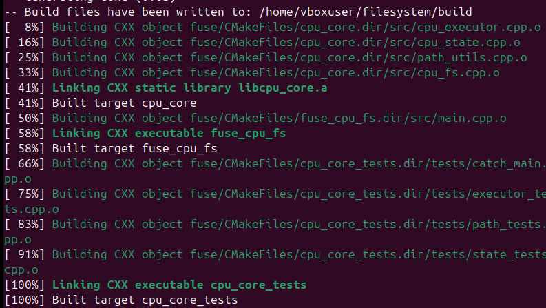
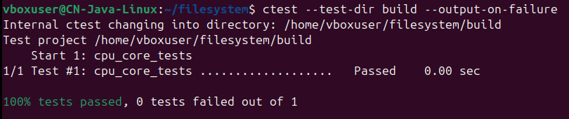
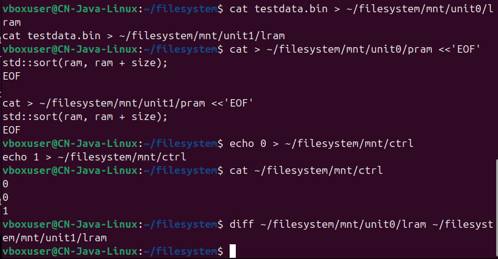
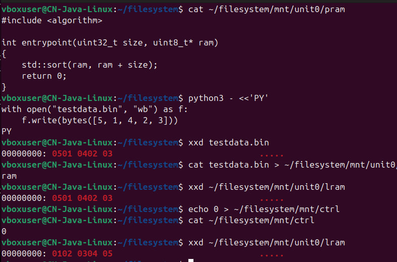
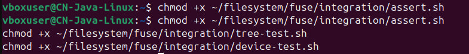
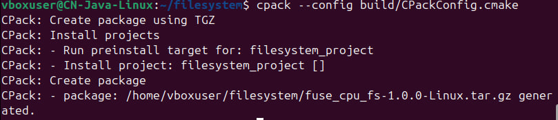
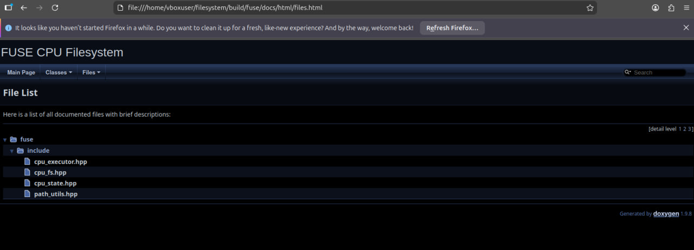

# Filesystem task

## Описание

В проекте реализован FUSE-драйвер, эмулирующий вычислительное устройство как файловую систему.

После монтирования в корне доступны:

- `ctrl`
- `unit0/`
- `unit1/`
- ...
- `unitN/`

Для каждого `unitX` доступны файлы:

- `pram` - память программы
- `lram` - локальная память данных

## Семантика файлов

### `pram`
В `pram` записывается текст программы для соответствующего юнита.

В учебной реализации поддерживается простой исполнитель:
если текст программы содержит `sort` или `std::sort`, то при запуске юнита содержимое `lram` сортируется по возрастанию байтов.

### `lram`
`lram` хранит бинарные данные юнита.

- запись в `lram` загружает данные;
- чтение из `lram` возвращает текущее содержимое;
- после выполнения программы данные могут измениться.

### `ctrl`
`ctrl` - управляющий файл.

Запись номера юнита в `ctrl` запускает выполнение программы для соответствующего `unitX`.

Пример:

```bash
echo 0 > mnt/ctrl
````

После этого будет выполнена программа из `unit0/pram` над данными `unit0/lram`.

При чтении `ctrl` возвращается журнал команд.

## Структура проекта

```text
filesystem/
  CMakeLists.txt
  README.md
  fuse/
    CMakeLists.txt
    README.md
    include/
      cpu_executor.hpp
      cpu_fs.hpp
      cpu_state.hpp
      path_utils.hpp
    src/
      main.cpp
      cpu_executor.cpp
      cpu_fs.cpp
      cpu_state.cpp
      path_utils.cpp
    tests/
      executor_tests.cpp
      path_tests.cpp
      state_tests.cpp
    docs/
      Doxyfile.in
    integration/
      ...
```

## Сборка
Установка зависимостей на Ubuntu:

```bash
sudo apt update
sudo apt install -y \
  build-essential \
  cmake \
  pkg-config \
  libfuse3-dev \
  catch2 \
  doxygen \
  graphviz
```

Сборка проекта:

```bash
cmake -S . -B build
cmake --build build
```

## Запуск тестов

```bash
ctest --test-dir build --output-on-failure
```

## Запуск файловой системы

Создать точку монтирования:

```bash
mkdir -p mnt
```

Запустить драйвер, например для 4 юнитов:

```bash
./build/fuse/fuse_cpu_fs --units=4 ./mnt
```

Файловая система будет доступна в `./mnt`.

## Пример использования

Запись программы:

```bash
cat > ./mnt/unit0/pram <<'EOF'
#include <algorithm>

int entrypoint(uint32_t size, uint8_t* ram)
{
    std::sort(ram, ram + size);
    return 0;
}
EOF
```

Подготовка бинарных данных:

```bash
python3 - <<'PY'
with open("testdata.bin", "wb") as f:
    f.write(bytes([5, 1, 4, 2, 3]))
PY
```

Загрузка данных:

```bash
cat testdata.bin > ./mnt/unit0/lram
```

Запуск юнита:

```bash
echo 0 > ./mnt/ctrl
```

Проверка результата:

```bash
xxd ./mnt/unit0/lram
```

Результат после сортировки:

```text
00000000: 0102 0304 05
```

## Документация

Генерация Doxygen:

```bash
cmake --build build --target docs
```

Сгенерированная HTML-документация будет находиться в каталоге `build`.

## Генерация пакета

```bash
cpack --config build/fuse/CPackConfig.cmake
```

## Что проверено

В проекте проверено:

* сборка через CMake;
* unit-тесты через Catch2;
* монтирование FUSE-файловой системы;
* чтение и запись `pram`;
* чтение и запись `lram`;
* запуск выполнения через `ctrl`;
* корректная сортировка данных в `lram`;
* генерация документации Doxygen;
* генерация установочного пакета через CPack.

## Подтверждающие файлы находятся в папке artifacts

## Подтверждающие скриншоты













