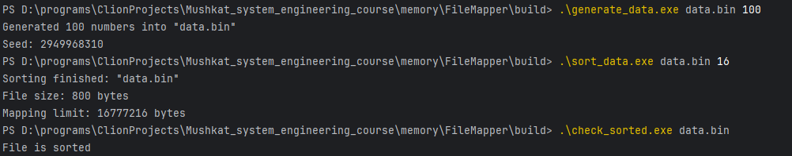

# FileMapper

## Задача

Нужно отсортировать большой бинарный файл, состоящий из значений `int64_t`, используя memory-mapped file:

* `mmap` на Linux/macOS
* `MapViewOfFile` на Windows

Размер одновременно отображённой памяти не должен превышать заданный лимит.
Если лимит не указан, по умолчанию используется `1/10` размера файла.

Примеры запуска:

```bash
sort_data data.bin
sort_data data.bin 100
```

Во втором примере лимит отображения равен `100 MB`.

## Идея решения

Использован внешний merge sort в две фазы.

### 1. Построение отсортированных кусков

Исходный файл читается кусками, каждый кусок:

* отображается в память;
* копируется в `std::vector<int64_t>`;
* сортируется через `std::sort`;
* записывается во временный бинарный run-файл.

### 2. Слияние run-файлов

Полученные отсортированные run-файлы попарно сливаются в новые временные файлы, пока не останется один итоговый файл.

## Почему выбран такой подход

Файл может быть слишком большим для загрузки целиком в память.
Поэтому нужен алгоритм внешней сортировки.

`external merge sort` подходит хорошо, потому что:

* работает по частям;
* не требует загружать весь файл сразу;
* естественно сочетается с memory mapping.

## Как соблюдается ограничение на отображённую память

### На фазе построения runs

Одновременно отображается только один входной фрагмент.

### На фазе слияния

Используются три окна:

* левый входной run;
* правый входной run;
* выходной run.

Размер каждого окна выбирается примерно как `limit / 3`, поэтому суммарный объём отображений не превышает лимит.

## Формат входных данных

Файл содержит только бинарные значения `int64_t` подряд, без заголовков.

Размер файла должен быть кратен `sizeof(int64_t)`.

## Вспомогательные утилиты

Вместе с решением приложены:

* `generate_data` — генерация тестового бинарного файла;
* `check_sorted` — проверка, что файл отсортирован корректно.

## Сборка

```bash
cmake -S . -B build
cmake --build build
```

## Использование

### Генерация данных

```bash
generate_data data.bin 1000000
```

или с фиксированным seed:

```bash
generate_data data.bin 1000000 42
```

### Сортировка

```bash
sort_data data.bin
sort_data data.bin 128
```

### Проверка результата

```bash
check_sorted data.bin
```

## Что реализовано

* сортировка бинарного файла `int64_t`;
* работа через memory mapping;
* ограничение на объём одновременно отображённой памяти;
* генератор тестовых данных;
* утилита проверки результата.
