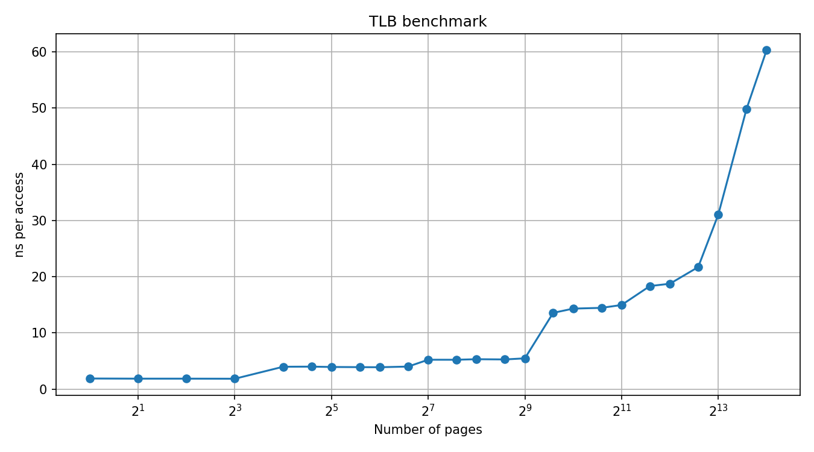

# Размер TLB

## Цель

В этой работе измеряется влияние числа страниц в рабочем наборе на время доступа к памяти и по резкому росту задержки оценивается размер TLB.

## Идея эксперимента

Используется pointer chasing по одной ячейке на страницу.  
Для каждого числа страниц создаётся случайный цикл переходов между страницами, и затем выполняется большое число зависимых обращений.

Такой паттерн выбран специально:

- шаг между обращениями равен размеру страницы;
- доступ идёт в случайном порядке;
- используется зависимая цепочка загрузок, поэтому процессор не может эффективно распараллелить чтения;
- аппаратный prefetch не помогает.

За счёт этого основным фактором становится работа TLB.

## Методика измерения

Для разных размеров рабочего набора измеряется среднее время одного обращения в наносекундах.

Измерения выполняются так:

1. выбирается число страниц;
2. строится случайный цикл переходов по страницам;
3. выполняется разогрев;
4. выполняется несколько повторов;
5. в качестве результата берётся медиана.

## Используемый процессор

13th Gen Intel(R) Core(TM) i7-13700F

### Полученные результаты

```csv
pages,footprint_kb,ns_per_access
1,4,1.8873
2,8,1.8603
4,16,1.8608
8,32,1.8472
16,64,3.9797
24,96,3.9986
32,128,3.9383
48,192,3.9091
64,256,3.8933
96,384,4.0112
128,512,5.2279
192,768,5.2229
256,1024,5.3204
384,1536,5.2775
512,2048,5.4758
768,3072,13.5687
1024,4096,14.3196
1536,6144,14.4567
2048,8192,14.9638
3072,12288,18.3291
4096,16384,18.7484
6144,24576,21.7077
8192,32768,31.0299
12288,49152,49.8379
16384,65536,60.2913
```


### График



## Вывод

По результатам эксперимента видно, что при малом числе страниц время доступа не меняется, а затем начинает расти.

Излом графика наблюдается при переходе от 512 к 768 страницам:
- 512 pages: 5.48 ns/access
- 768 pages: 13.57 ns/access

Это позволяет оценить характерную ёмкость TLB для данного паттерна доступа в **512–768 страниц**, что соответствует **2–3 MB отображённой памяти** при размере страницы 4 KB.

При дальнейшем увеличении числа страниц задержка продолжает расти, что согласуется с гипотезой о переполнении TLB и увеличении числа промахов трансляции.